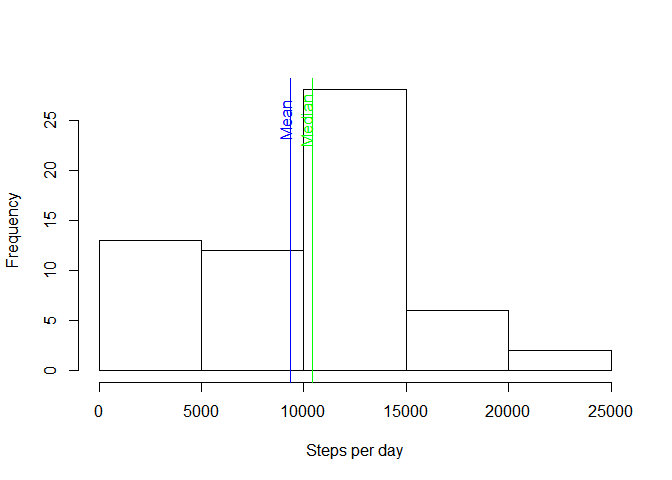
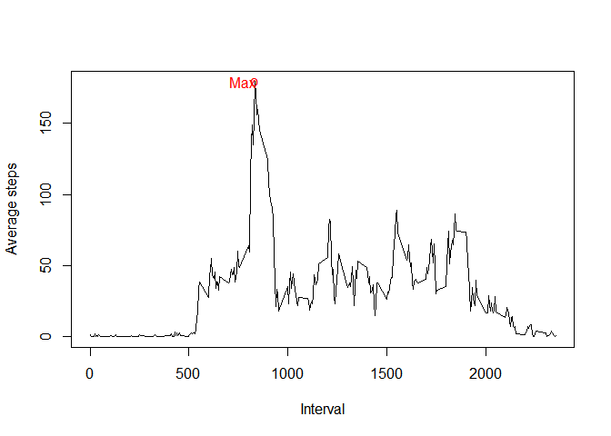
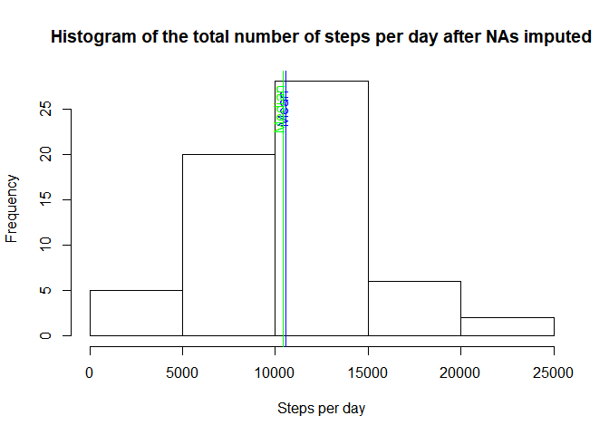
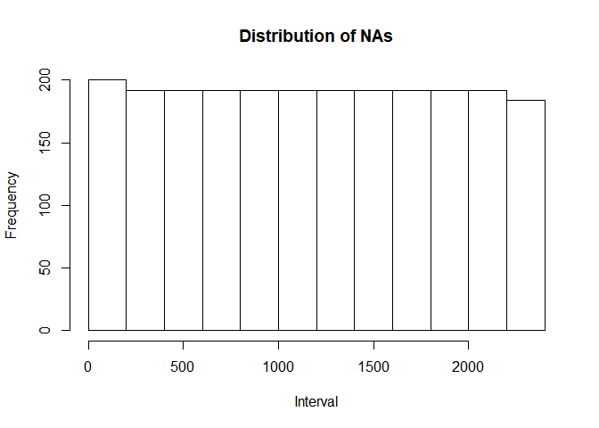
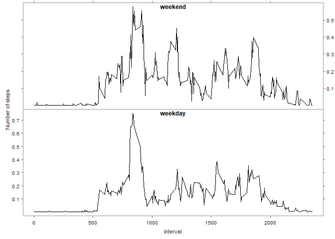

## Histogram of the total number of steps taken each day

<!-- -->

## Mean and median number of steps taken each day
Mean: `9354.23`. Median: `10395`.

## Time series plot of the average number of steps taken
<!-- -->

The 5-minute interval that, on average, contains the maximum number of steps: `835`.

## Histogram of the total number of steps taken each day, after missing values are imputed

The total number of missing values in the dataset: `2304`. NAs are imputed from the average steps in the same time interval.
<!-- -->

Mean: `10581.01`. Median: `10395`.

Mean have changed after imputation: as NAs have been replaced with average values, mean value rose up. Median was not affected because NAs are uniformly distributed across the intervals as seen in the histogram of NAs. A slight quirk in data is probably attributable to the misinterpretation of where midnight data point belongs.
<!-- -->

## Panel plot comparing the average number of steps taken per 5-minute interval across weekdays and weekends

<!-- -->

